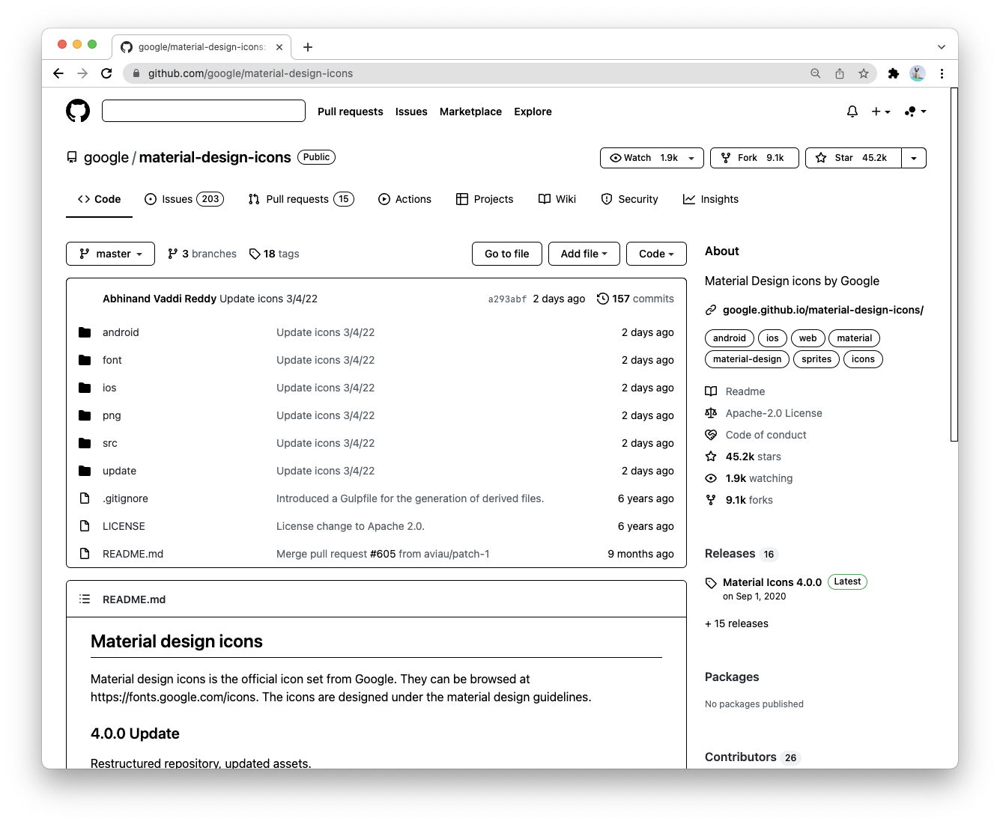

# Ink Chrome Extension

A chrome extension to make all websites have better view in e-ink screen.

## How to use

1. Open `chrome://extensions/` in Chrome.
2. Enable `Developer mode`.
3. Click `Load unpacked` button and choose the `src` folder.

## Samples

