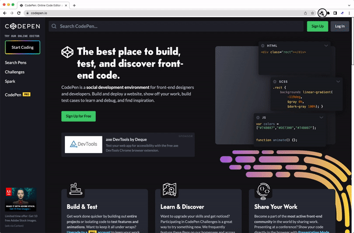

# E-ink Viewable

A chrome extension to make all websites viewable in e-ink screen, convert dark theme to light theme automatically.

## Modes

The popup has one switch for the current site (changes apply immediately):

- **Comfort (Auto, default)** — the per-node conversion engine described below. Keeps the site's own look as far as possible.
- **High contrast (Contrast)** — black-and-white mode: one wildcard stylesheet forces black text on every element (`!important`) — including the glyph paint (`-webkit-text-fill-color`), form placeholders and native control accents that plain `color` cannot reach — while backgrounds go white only where the element itself painted one (a color, image or gradient); elements the site left transparent stay transparent, so layered designs keep their look. Colored borders and box-shadows turn black while transparent ones (spacing tricks) stay — CSS cannot tell them apart, so a small per-element pass fixes all three, batched like the engine; the same pass flips inline the white text inside open shadow roots (a document stylesheet never matches shadow content) and behind ID-carrying `!important` site rules. Pseudo-element graphics (selected-tab underlines, badges) go black like borders, light svg fills follow the text color, and repaints via class changes or form commits are re-checked. The first pass waits for `DOMContentLoaded`, when all stylesheets are final. Images keep their own colors — on every site, dark or light.
- **Off** — the site's own look.

The gear icon in the popup sets the **default mode** for sites without their own choice. The top switch turns the extension **on or off everywhere at once** — for reading on regular monitors (#4) — and a `toggle-enabled` keyboard command (no default key; configure at `chrome://extensions/shortcuts`) flips the same switch. The keyboard shortcut (`Ctrl+Shift+X` by default) flips the current site between off and its last mode.

## Languages

Seventeen: English, 简体中文, 繁體中文, 日本語, 한국어, Español, Português (Brasil), Français, Deutsch, Italiano, Русский, العربية, हिन्दी, Bahasa Indonesia, Tiếng Việt, ไทย, Türkçe. The popup's settings panel (gear icon) has a language dropdown — by default it follows the browser's language (`src/_locales/`); Arabic flips the popup to right-to-left. Adding a language = dropping a `messages.json` into a new locale folder plus one `<option>` in `popup.html`.

## How it works

- **Zero footprint when disabled.** On sites set to Off — and everywhere while the default mode is Off — the extension adds no CSS at all.
- **Colors only, and only what breaks on white.** Dark backgrounds become white; near-white text, borders and svg fills become black. Links, accent colors and mid grays keep the page's own color, so a page that is already light stays essentially untouched. All modern CSS color formats are understood (`oklch()`, `oklab()`, `lab()`, `color()`, `hsl()` — the ones Tailwind v4 and friends emit), and dark `:hover` / `:focus` styles are flipped the moment they appear — then once more after the site's own color transition settles, so animated hover colors can't stay invisible. Form state (`input:checked` tab groups) and class changes (theme toggles) re-plan the affected nodes through the same batched pipeline, and a re-plan only writes values that actually changed. Text that sits on a photo (banner images and the like) keeps the color the site chose for it — only opaque dark backgrounds are rewritten. `::before` / `::after` decorations are converted too, and gradient-clipped text (`background-clip: text`) is treated as text paint, not background.
- **No jank.** Computed styles are read in one phase and written in another, elements are processed in animation-frame batches and at most once each. Re-plans cost one computed-style read when nothing changed, class churn on framework pages costs one read per changed node, and the mutation observer only watches added nodes and `class` attributes — it can never react to its own writes.

Known limits: sites restyling existing nodes via inline `style` attribute writes are not observed (class changes and form state are), and shadow-DOM internals are not entered.

## Install from Chrome Web Store

https://chrome.google.com/webstore/detail/e-ink-viewable/lfeckmgmmnioloncabbkcddnnooofdmg

## Install from source code

1. Open `chrome://extensions/` in Chrome.
2. Enable `Developer mode`.
3. Click `Load unpacked` button and choose the `src` folder.

## Architecture

All decisions live in pure modules that never touch `chrome.*`, so every behavior is locked by unit tests running in plain Node:

- `src/color.js` — color math: parsing every CSS color format and deciding which colors to flip.
- `src/engine.js` — the conversion engine: skip rules, effective-background resolution, batching, mutation and hover handling. Computed styles and frame scheduling are injected; `inject.js` is its thin glue.
- `src/toggle.js` — per-site mode, global default and shortcut state on top of injected storage, plus one-time migration from the pre-1.4 pause flags.
- `src/popup-ui.js` — every popup label and click behavior, on injected elements/service.

`src/inject.js`, `src/background.js` and `src/popup.js` contain only `chrome.*` wiring.

## Development

```
node --test tests/*.test.js
```

## More from the author

[PlainApp](https://plainapp.app) — an open-source Android app that lets you securely manage your phone (files, media, contacts, SMS, calls) from a web browser. Also on [Google Play](https://play.google.com/store/apps/details?id=com.ismartcoding.plain).

## Samples




